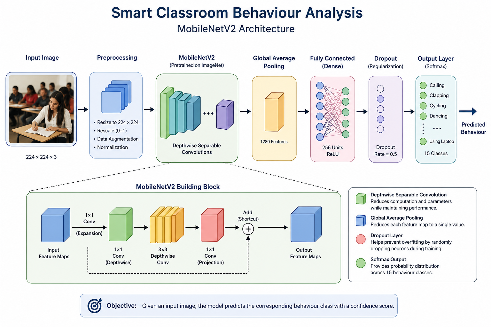

# Smart Classroom Behavior Analysis

A deep learning-based image classification project for analyzing human activities as a foundation for Smart Classroom Behavior Analysis.

The project uses **MobileNetV2 Transfer Learning and Fine-Tuning** to classify human activities into 15 classes.

## Project Overview

The goal of this project is to develop an image-based behavior classification system using Deep Learning and Computer Vision.

The system takes an input image and predicts the corresponding human activity.

This project serves as a foundation for future classroom-specific behavior analysis using images and videos.

## Objectives

- Develop an image classification model for human activity recognition
- Apply Transfer Learning using MobileNetV2
- Fine-tune the pretrained model for the target dataset
- Evaluate model performance
- Perform behavior prediction on individual images
- Explore future real-time classroom behavior analysis

## Dataset

The project uses the **Human Action Recognition** dataset.

### Dataset Statistics

- **Total Images:** 12,600
- **Training Images:** 10,080
- **Validation Images:** 2,520
- **Number of Classes:** 15

### Behavior Classes

1. Calling
2. Clapping
3. Cycling
4. Dancing
5. Drinking
6. Eating
7. Fighting
8. Hugging
9. Laughing
10. Listening to Music
11. Running
12. Sitting
13. Sleeping
14. Texting
15. Using Laptop

## Model Architecture

The project uses **MobileNetV2**, a lightweight convolutional neural network pretrained on ImageNet.

### Training Approach

**Input Image → Preprocessing → MobileNetV2 → Global Average Pooling → Dense → Dropout → SoftMax → Predicted Behavior**
